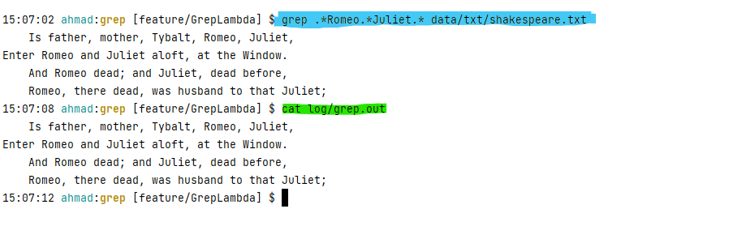

# Introduction
This application is designed to create the GREP method used in the Linux terminal with Java. It takes a directory and outputs the results in a file.
It is developed using JDK-8 Java. JDK-8 introduced streams and lambada, which I utilized in the grep application. Image is created and uploaded on docker for ease of use and distribution.
Technologies that I used to develop this application:

- JDK 8 
- Docker
- Maven
- intellij


# Quick Start
````bash
mkdir -p grep_app/data/txt | wget -O grep_app/data/txt/shakespeare.txt https://gist.githubusercontent.com/jarviscanada/c5408fc8f8ad0aa9606f76c8d4fde269/raw/c04d4f5d5adea39fff35ba3b9ec889d667292a0e/shakespeare.txt
cd grep_app
docker pull asalaymeh/grep
docker run --rm -v `pwd`/data:/data -v `pwd`/log:/log asalaymeh/grep .*Romeo.*Juliet.* /data /log/grep.out
cat log/grep.out


````

#Implemenation


| Functions | Description                                                                           |
|-----------|---------------------------------------------------------------------------------------|
| ListFiles | Looks through a directory/nested directory and grabs all files and saves them to a list |
| readLines | reads a list of files                                                                 |
| containsPattern| checks if line contains a regex pattern                                               |
| writeToeFile | creates and writes to a file                                                          |


## Pseudocode
The Process for this application is the following: we want to go through all files in our directory and check if the file contents match the REGEX pattern that the user input and outputs the results to grep.out
```
for file in files:
    for line in file:
        if line contatins pattern:
            write line to grep.out
 
```


## Performance Issue

Initially, the program required a lot of heap memory to store the list data structure, which can get extensive and not efficient for the program.
To combat this, I used the library streams from JDK-8,
which helps take extensive data and pipeline them
without storing any information to get the desired outcome.


# Test
To test the Grep Application, I compared the program's results to the Linux command "grep."




# Deployment
The Grep application is deployed for use on docker hub.
```bash
docker pull asalaymeh/grep
```
the source code is hosted on github. 


# Improvement
1. Implement a User interface to allow for mass use
2. Return or give more information on the matched lines rather than having a big result file.
3. Implement a way to replace matched words/lines with anything the user wants. 